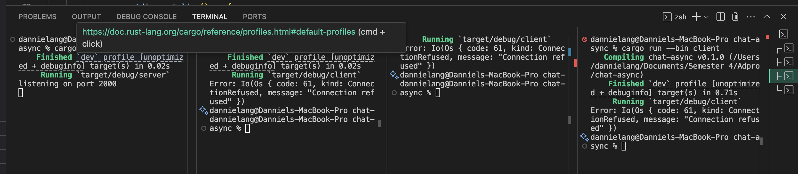

# Experiment 2.1: Original code, and how it run

Dicontoh saya menjalankan 3 client dan 1 server.
Program menunjukkan sistem seperti broadcast dimana server menerima permintaan pesan dari client dan mengirimkan pesan tersebut ke client yang terhubung dengannya. 

# Experiment 2.2: Modifying port

Port harus sama antara client dan server, karena untuk sebuah connection terhubung, Port yang dilisten oleh server harus sama dengan tempat client mengirimkan pesan.

Pada server.rs
`let listener = TcpListener::bind("127.0.0.1:2000").await?;`

Pada client.rs diganti menjadi 
`ClientBuilder::from_uri(Uri::from_static("ws://127.0.0.1:8000"))`

Dan karena connection nya tidak ada, maka ConnectionRefused dikeluarkan oleh rust
